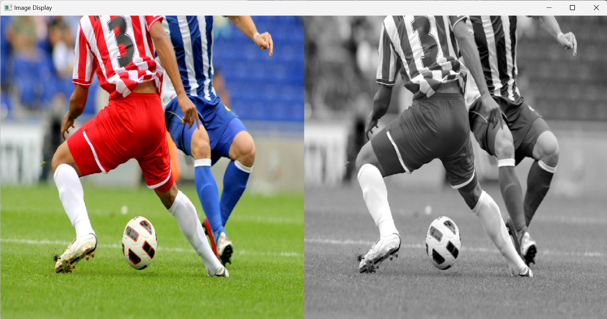
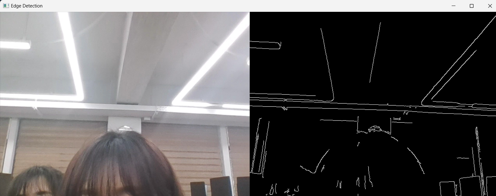
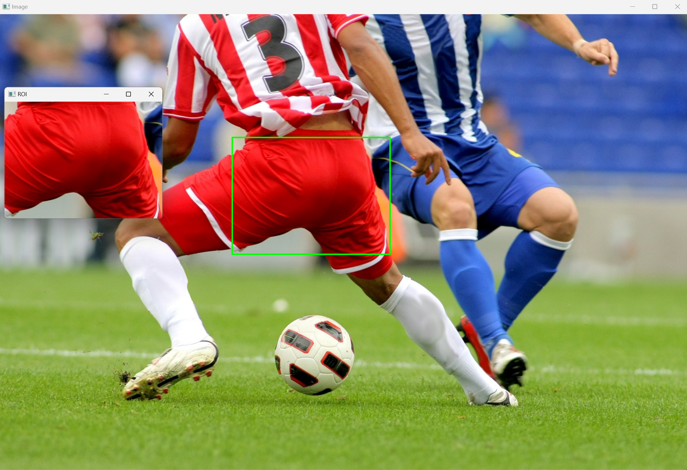

# 01. 이미지 불러오기 및 그레이스케일 변환
## 📝 과제 설명
- 이미지를 불러와 그레이 스케일로 변환한 후, 원본 이미지와 그레이 스케일 이미지를 나란히 보여줌.
- OpenCV를 사용하여 이미지를 표시하는 창의 크기를 조정하고, 사용자가 키를 누를 때까지 이미지를 화면에 띄움.
- 마지막으로, 모든 OpenCV 창을 종료함.

<br>

## 🍁 코드
<details>
  <summary> 클릭해서 코드 보기 </summary>

  ```python
import cv2 as cv
import numpy as np

# 이미지 불러오기
image = cv.imread("C:/Users/82107/Desktop/cv/soccer.jpg")  # 불러올 이미지 파일명 지정
if image is None:
    print("이미지를 불러올 수 없습니다.")
    exit()

# 그레이 스케일 변환
gray_image = cv.cvtColor(image, cv.COLOR_BGR2GRAY)

# 원본 이미지와 그레이 스케일 이미지를 나란히 연결
combined_image = np.hstack((image, cv.cvtColor(gray_image, cv.COLOR_GRAY2BGR)))

# 이미지 창 크기 조정
window_name = 'Image Display'
cv.namedWindow(window_name, cv.WINDOW_NORMAL)  # 창 크기 조정 가능하게 설정
cv.resizeWindow(window_name, 1200, 600)  # 원하는 창 크기 설정 (너비 1200, 높이 600)

# 이미지 출력
cv.imshow(window_name, combined_image)  # 첫 번째 인자는 창 제목, 두 번째 인자는 이미지
cv.waitKey(0)  # 아무 키나 누르면 창 닫기
cv.destroyAllWindows()
 ```
</details>

<br>

## 💻 결과화면


<br>
<br>

# 02. 웹캠 영상에서 에지 검출
## 📝 과제 설명
- 웹캠을 이용해 실시간 비디오를 캡처하고, 각 프레임을 그레이 스케일로 변환한 후 Canny 알고리즘을 사용해 에지(경계)를 검출함.
- 검출된 에지를 원본 이미지와 나란히 화면에 표시하며, 사용자가 'q' 키를 누르면 비디오 캡처가 종료됨.
- OpenCV를 사용해 실시간 비디오 처리를 하고, 창 크기를 조정할 수 있게 설정함함.

<br>

## 🍁 코드
<details>
  <summary> 클릭해서 코드 보기 </summary>

  ```python
import cv2 as cv

def main():
    cap = cv.VideoCapture(0)  # 웹캠 연결
    
    if not cap.isOpened():
        print("Error: Could not open webcam.")
        return
    
    while True:
        ret, frame = cap.read()
        if not ret:
            print("Error: Could not read frame.")
            break
        
        gray = cv.cvtColor(frame, cv.COLOR_BGR2GRAY)  # 그레이 스케일 변환
        edges = cv.Canny(gray, 100, 200)  # 에지 검출 (하한:100, 상한:200)
        
        edges_color = cv.cvtColor(edges, cv.COLOR_GRAY2BGR)  # 가로로 합치기 위해 컬러 변환
        combined = cv.hconcat([frame, edges_color])  # 원본과 에지 검출 결과 연결
        
        cv.namedWindow("Edge Detection", cv.WINDOW_NORMAL)  # 창 크기 조정 가능하게 설정
        cv.resizeWindow("Edge Detection", 1200, 600)  # 창 크기 조정
        cv.imshow("Edge Detection", combined)  # 화면에 출력
        
        if cv.waitKey(1) & 0xFF == ord('q'):  # q 키를 누르면 종료
            break
    
    cap.release()
    cv.destroyAllWindows()

if __name__ == "__main__":
    main()
 ```
</details>

<br>

## 💻 결과화면


<br>
<br>

# 03. 마우스로 영역 선택 및 ROI(관심영역) 추출
## 📝 과제 설명
- OpenCV를 사용하여 이미지에서 사용자가 마우스로 지정한 영역(ROI)을 선택하고, 선택된 영역을 저장함.
- 마우스로 영역을 드래그하여 사각형을 그리면, 그 영역이 ROI로 지정됨.
- 'r' 키로 초기화하고, 's' 키로 ROI를 저장하며, 'q' 키로 프로그램을 종료함.

<br>

## 🍁 코드
<details>
  <summary> 클릭해서 코드 보기 </summary>

  ```python
import cv2 as cv
import numpy as np

# 전역 변수 초기화
roi = None
start_x, start_y, end_x, end_y = -1, -1, -1, -1
drawing = False
image = cv.imread("C:/Users/82107/Desktop/cv/soccer.jpg")  # 이미지 로드
original_image = image.copy()

def mouse_callback(event, x, y, flags, param):
    global start_x, start_y, end_x, end_y, drawing, roi, image
    
    if event == cv.EVENT_LBUTTONDOWN:  # 마우스 클릭 시작
        start_x, start_y = x, y
        drawing = True
    
    elif event == cv.EVENT_MOUSEMOVE:  # 드래그 중
        if drawing:
            image = original_image.copy()
            cv.rectangle(image, (start_x, start_y), (x, y), (0, 255, 0), 2)
    
    elif event == cv.EVENT_LBUTTONUP:  # 마우스 버튼 놓기
        end_x, end_y = x, y
        drawing = False
        roi = original_image[start_y:end_y, start_x:end_x]
        cv.imshow("ROI", roi)

def main():
    global image, original_image, roi
    cv.namedWindow("Image")
    cv.setMouseCallback("Image", mouse_callback)
    
    while True:
        cv.imshow("Image", image)
        key = cv.waitKey(1) & 0xFF
        
        if key == ord('r'):  # r 키를 누르면 초기화
            image = original_image.copy()
            roi = None
        elif key == ord('s') and roi is not None:  # s 키를 누르면 ROI 저장
            cv.imwrite("roi.jpg", roi)
            print("ROI saved as roi.jpg")
        elif key == ord('q'):  # q 키를 누르면 종료
            break
    
    cv.destroyAllWindows()

if __name__ == "__main__":
    main()
 ```
</details>

<br>

## 💻 결과화면



