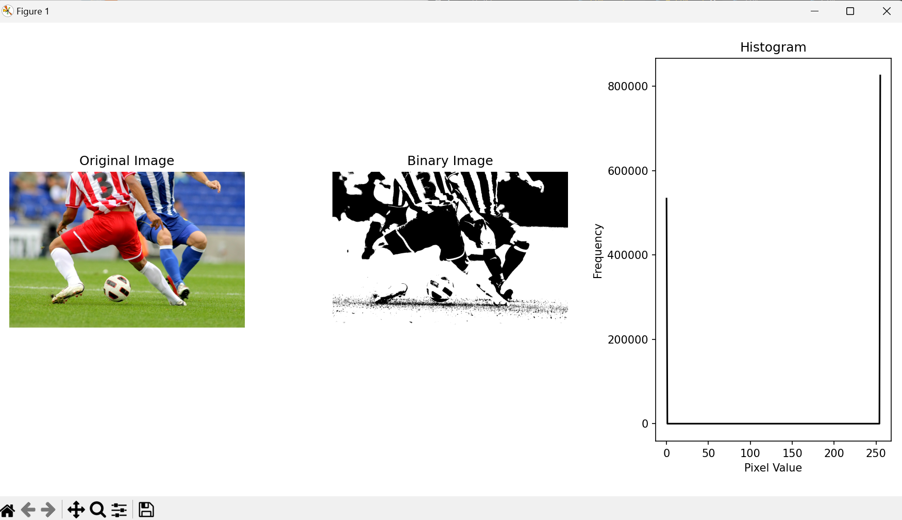
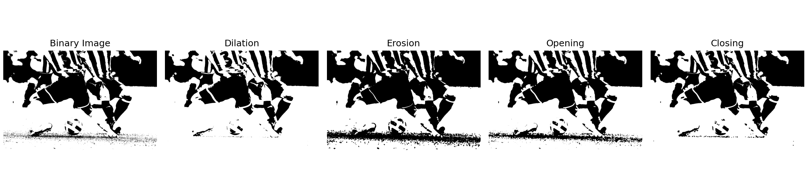
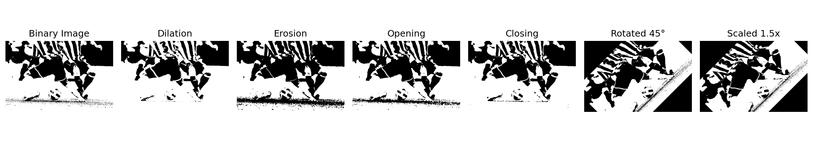

## 1️⃣ 이진화 및 히스토그램 구하기
### 🌀 과제 설명
- 이미지를 불러와서 <b>그레이스케일</b> 변환 후 <b>이진화(Thresholding)</b> 수행
- 이진화된 이미지의 <b>히스토그램</b>을 계산하고 시각화
<br>
  
### 📌 개념
- OpenCV의 cv.imread(), cv.cvtColor(), cv.threshold() 함수 이해
- 히스토그램의 개념과 cv.calcHist()를 이용한 히스토그램 생성 방법
- Matplotlib을 활용한 데이터 시각화
<br>

### 💻 주요 코드
<p>✔ <b>이미지 불러오기 </b><code>cv.imread(image_path)</code><br></p>
<p>✔ <b>그레이스케일 변환</b> <code>cv.cvtColor(image, cv.COLOR_BGR2GRAY)</code><br>
<p>✔ <b>이진화 적용</b> <code>cv.threshold(gray_image, 127, 255, cv.THRESH_BINARY)</code><br>
<p>✔ <b>히스토그램 계산</b> <code>cv.calcHist([binary_image], [0], None, [256], [0, 256])</code><br>
<p>✔ <b>시각화</b> <code>plt.plot(hist, color='black')</code><br>
<br>

<br>


<details>
  <summary><b> 🧿 클릭해서 코드 보기 </b></summary>
  
  ```python
import cv2 as cv
import numpy as np
import matplotlib.pyplot as plt

def process_image(image_path):
    # 이미지 불러오기
    image = cv.imread(image_path)
    if image is None:
        print("이미지를 불러올 수 없습니다.")
        return
    
    # 그레이스케일 변환
    gray_image = cv.cvtColor(image, cv.COLOR_BGR2GRAY)
    
    # 이진화
    threshold_value = 127
    _, binary_image = cv.threshold(gray_image, threshold_value, 255, cv.THRESH_BINARY)
    
    # 히스토그램 계산
    hist = cv.calcHist([binary_image], [0], None, [256], [0, 256])
    
    # 결과 출력
    plt.figure(figsize=(10, 5))
    
    # 원본 이미지 출력
    plt.subplot(1, 3, 1)
    plt.imshow(cv.cvtColor(image, cv.COLOR_BGR2RGB))
    plt.title("Original Image")
    plt.axis("off")
    
    # 이진화된 이미지 출력
    plt.subplot(1, 3, 2)
    plt.imshow(binary_image, cmap='gray')
    plt.title("Binary Image")
    plt.axis("off")
    
    # 히스토그램 출력
    plt.subplot(1, 3, 3)
    plt.plot(hist, color='black')
    plt.title("Histogram")
    plt.xlabel("Pixel Value")
    plt.ylabel("Frequency")
    
    plt.tight_layout()
    plt.show()

# 예제 이미지 경로
image_path = "C:/Users/82107/Desktop/cv/soccer.jpg"
process_image(image_path)

 ```
</details>

<br>

### 🕵‍♀ 결과화면


<br>
<br>

## 2️⃣ 모폴로지 연산 적용하기
### 🌀 과제 설명
- 이진화된 이미지에 대해 <b>팽창(Dilation), 침식(Erosion), 열림(Opening), 닫힘(Closing) 연산</b>을 수행하여<br> 노이즈 제거 및 형태 보정
<br>

### 📌 개념
- 모폴로지 연산(Morphological Operations) 개념
- cv.getStructuringElement()를 활용한 커널(kernel) 생성
- cv.morphologyEx()를 이용한 모폴로지 연산 적용 방법
<br>

### 💻 주요 코드
<p>✔ <b>커널 생성</b> <code>cv.getStructuringElement(cv.MORPH_RECT, (5, 5))</code><br>
<p>✔ <b>팽창(Dilation) 연산</b> <code>cv.morphologyEx(binary_image, cv.MORPH_DILATE, kernel)</code><br>
<p>✔ <b>침식(Erosion) 연산</b> <code>cv.morphologyEx(binary_image, cv.MORPH_ERODE, kernel)</code><br>
<p>✔ <b>열림(Opening) 연산</b> <code>cv.morphologyEx(binary_image, cv.MORPH_OPEN, kernel)</code><br>
<p>✔ <b>닫힘(Closing) 연산</b> <code>cv.morphologyEx(binary_image, cv.MORPH_CLOSE, kernel)</code><br>
<br>

<details>
  <summary><b> 🧿 클릭해서 코드 보기 </b></summary>

  ```python
import cv2 as cv
import numpy as np
import matplotlib.pyplot as plt

def process_image(image_path):
    # 이미지 불러오기
    image = cv.imread(image_path)
    if image is None:
        print("이미지를 불러올 수 없습니다.")
        return
    
    # 그레이스케일 변환
    gray_image = cv.cvtColor(image, cv.COLOR_BGR2GRAY)
    
    # 이진화
    threshold_value = 127
    _, binary_image = cv.threshold(gray_image, threshold_value, 255, cv.THRESH_BINARY)
    
    # 모폴로지 연산을 위한 커널 생성
    kernel = cv.getStructuringElement(cv.MORPH_RECT, (5, 5))
    
    # 모폴로지 연산 적용
    dilation = cv.morphologyEx(binary_image, cv.MORPH_DILATE, kernel)
    erosion = cv.morphologyEx(binary_image, cv.MORPH_ERODE, kernel)
    opening = cv.morphologyEx(binary_image, cv.MORPH_OPEN, kernel)
    closing = cv.morphologyEx(binary_image, cv.MORPH_CLOSE, kernel)
    
    # 결과 출력
    plt.figure(figsize=(15, 5))
    
    # 원본 이미지 출력
    plt.subplot(1, 5, 1)
    plt.imshow(binary_image, cmap='gray')
    plt.title("Binary Image")
    plt.axis("off")
    
    # 팽창
    plt.subplot(1, 5, 2)
    plt.imshow(dilation, cmap='gray')
    plt.title("Dilation")
    plt.axis("off")
    
    # 침식
    plt.subplot(1, 5, 3)
    plt.imshow(erosion, cmap='gray')
    plt.title("Erosion")
    plt.axis("off")
    
    # 열림
    plt.subplot(1, 5, 4)
    plt.imshow(opening, cmap='gray')
    plt.title("Opening")
    plt.axis("off")
    
    # 닫힘
    plt.subplot(1, 5, 5)
    plt.imshow(closing, cmap='gray')
    plt.title("Closing")
    plt.axis("off")
    
    plt.tight_layout()
    plt.show()

# 예제 이미지 경로
image_path = "C:/Users/82107/Desktop/cv/soccer.jpg"  # 여기에 사용할 이미지 경로를 입력하세요
process_image(image_path)
 ```
</details>

<br>

### 🕵‍♀ 결과화면


<br>
<br>

## 3️⃣ 기하 연산 및 선형 보간 적용하기
### 🌀 과제 설명
- 이미지를 45도 회전하고, 1.5배 확대
- 확대된 이미지에 <b>선형 보간(Bilinear Interpolation)</b> 적용
<br>

### 📌 개념
- cv.getRotationMatrix2D()를 이용한 회전 변환 행렬 생성
- cv.warpAffine()을 이용한 이미지 회전 적용 방법
- cv.resize()를 이용한 이미지 확대 및 보간법(Interpolation) 개념
<br>

### 💻 주요 코드
<p> ✔ <b> 회전 행렬 생성</b> <code>cv.getRotationMatrix2D((cols/2, rows/2), 45, 1)</code><br>
<p> ✔ <b> 회전 적용</b> <code>cv.warpAffine(binary_image, rotation_matrix, (cols, rows), flags=cv.INTER_LINEAR)</code><br>
<p> ✔ <b> 이미지 확대 및 보간법 적용</b> <code>cv.resize(rotated_image, (int(cols*1.5), int(rows*1.5)), interpolation=cv.INTER_LINEAR)</code><br>
<br>


### 코드
<details>
  <summary><b> 🧿 클릭해서 코드 보기 </b></summary>

  ```python
import cv2 as cv
import numpy as np
import matplotlib.pyplot as plt

def process_image(image_path):
    # 이미지 불러오기
    image = cv.imread(image_path)
    if image is None:
        print("이미지를 불러올 수 없습니다.")
        return
    
    # 그레이스케일 변환
    gray_image = cv.cvtColor(image, cv.COLOR_BGR2GRAY)
    
    # 이진화
    threshold_value = 127
    _, binary_image = cv.threshold(gray_image, threshold_value, 255, cv.THRESH_BINARY)
    
    # 모폴로지 연산을 위한 커널 생성
    kernel = cv.getStructuringElement(cv.MORPH_RECT, (5, 5))
    
    # 모폴로지 연산 적용
    dilation = cv.morphologyEx(binary_image, cv.MORPH_DILATE, kernel)
    erosion = cv.morphologyEx(binary_image, cv.MORPH_ERODE, kernel)
    opening = cv.morphologyEx(binary_image, cv.MORPH_OPEN, kernel)
    closing = cv.morphologyEx(binary_image, cv.MORPH_CLOSE, kernel)
    
    # 기하 연산: 회전 (45도)
    rows, cols = binary_image.shape[:2]
    rotation_matrix = cv.getRotationMatrix2D((cols / 2, rows / 2), 45, 1)
    rotated_image = cv.warpAffine(binary_image, rotation_matrix, (cols, rows), flags=cv.INTER_LINEAR)
    
    # 확대 (1.5배) 및 선형 보간 적용
    scale_factor = 1.5
    new_size = (int(cols * scale_factor), int(rows * scale_factor))
    resized_image = cv.resize(rotated_image, new_size, interpolation=cv.INTER_LINEAR)
    
    # 결과 출력
    plt.figure(figsize=(15, 5))
    
    # 원본 이미지 출력
    plt.subplot(1, 7, 1)
    plt.imshow(binary_image, cmap='gray')
    plt.title("Binary Image")
    plt.axis("off")
    
    # 팽창
    plt.subplot(1, 7, 2)
    plt.imshow(dilation, cmap='gray')
    plt.title("Dilation")
    plt.axis("off")
    
    # 침식
    plt.subplot(1, 7, 3)
    plt.imshow(erosion, cmap='gray')
    plt.title("Erosion")
    plt.axis("off")
    
    # 열림
    plt.subplot(1, 7, 4)
    plt.imshow(opening, cmap='gray')
    plt.title("Opening")
    plt.axis("off")
    
    # 닫힘
    plt.subplot(1, 7, 5)
    plt.imshow(closing, cmap='gray')
    plt.title("Closing")
    plt.axis("off")
    
    # 회전 이미지
    plt.subplot(1, 7, 6)
    plt.imshow(rotated_image, cmap='gray')
    plt.title("Rotated 45°")
    plt.axis("off")
    
    # 확대 및 선형 보간 이미지
    plt.subplot(1, 7, 7)
    plt.imshow(resized_image, cmap='gray')
    plt.title("Scaled 1.5x")
    plt.axis("off")
    
    plt.tight_layout()
    plt.show()

# 예제 이미지 경로
image_path = "C:/Users/82107/Desktop/cv/soccer.jpg"  # 여기에 사용할 이미지 경로를 입력하세요
process_image(image_path)

 ```
</details>

<br>

### 🕵‍♀ 결과화면



