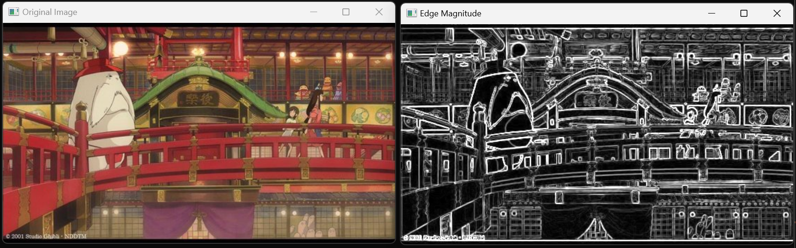
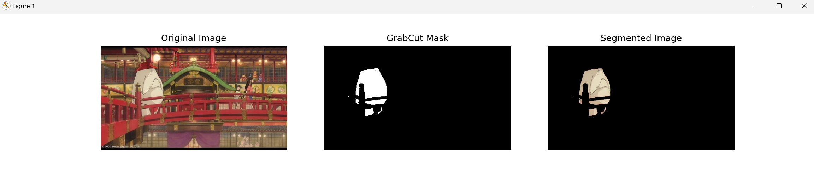

## 1️⃣ 소벨 에지 검출 및 결과 시각화
### 🌀 과제 설명
- 소벨(Sobel) 필터를 사용해 엣지를 검출
<br>
  
### 📌 개념
- 소벨 필터를 이용해 X, Y 방향의 기울기를 계산
- 기울기를 조합하여 에지 강도(edge magnitude) 계산
- 검출된 엣지를 시각화
<br>

### 💻 주요 코드
<p>✔ <b>이미지 불러오기 </b><code>cv.imread(image_path)</code><br></p>
<p>✔ <b>그레이스케일 변환</b> <code>cv.cvtColor(image, cv.COLOR_BGR2GRAY)</code><br>
<p>✔ <b>소벨 필터 적용</b> <code>cv.Sobel(src, ddepth, dx, dy, ksize)</code><br>
<p>✔ <b>에지 강도 계산</b> <code>edge_magnitude = cv.magnitude(sobel_x, sobel_y)</code><br>
<p>✔ <b>이미지 시각화</b> <code>cv.imshow()</code><br>
<br>

<br>


<details>
  <summary><b> 🧿 클릭해서 코드 보기 </b></summary>
  
  ```python
import cv2 as cv
import numpy as np
import matplotlib.pyplot as plt

def sobel_edge_detection(image_path):
    # 이미지 불러오기
    image = cv.imread(image_path)
    if image is None:
        print("Error: 이미지 파일을 불러올 수 없습니다.")
        return
    
    # 그레이스케일 변환
    gray = cv.cvtColor(image, cv.COLOR_BGR2GRAY)
    
    # 소벨 필터 적용 (X축, Y축 방향)
    sobel_x = cv.Sobel(gray, cv.CV_64F, 1, 0, ksize=3)
    sobel_y = cv.Sobel(gray, cv.CV_64F, 0, 1, ksize=3)
    
    # 에지 강도 계산
    edge_magnitude = cv.magnitude(sobel_x, sobel_y)
    edge_magnitude = cv.convertScaleAbs(edge_magnitude)
    
    # OpenCV 창을 이용한 시각화
    cv.imshow('Original Image', image)
    cv.imshow('Edge Magnitude', edge_magnitude)
    cv.waitKey(0)  # 키 입력을 기다림
    cv.destroyAllWindows()  # 창 닫기

# 테스트 실행
image_path = 'C:/Users/82107/Desktop/cv/edgeDetectionImage.jpg'  # 적절한 이미지 경로 입력
sobel_edge_detection(image_path)

 ```
</details>

<br>

### 🕵‍♀ 결과화면


<br>
<br>

## 2️⃣ 캐니 에지 및 허프 변환을 이용한 직선 검출
### 🌀 과제 설명
- 이진화된 이미지에 대해 <b>팽창(Dilation), 침식(Erosion), 열림(Opening), 닫힘(Closing) 연산</b>을 수행하여<br> 노이즈 제거 및 형태 보정
<br>

### 📌 개념
- 캐니 에지 검출을 이용해 엣지를 추출
- 허프 변환(Hough Transform)을 이용해 직선을 검출
- 검출된 직선을 원본 이미지에 표시
<br>

### 💻 주요 코드
<p>✔ <b>캐니 에지 검출</b> <code>cv.Canny(image, threshold1, threshold2)</code><br>
<p>✔ <b>허프 변환을 사용한 직선 검출</b> <code>cv.HoughLinesP(image, rho, theta, threshold, minLineLength, maxLineGap)</code><br>
<p>✔ <b>검출된 직선을 원본 이미지에 빨간색으로 표시</b> <code>cv.line(image, (x1, y1), (x2, y2), (0, 0, 255), 2)</code><br>
<br>

<details>
  <summary><b> 🧿 클릭해서 코드 보기 </b></summary>

  ```python
import cv2 as cv
import numpy as np
import matplotlib.pyplot as plt

def detect_lines(image_path):
    # 이미지 불러오기
    image = cv.imread(image_path)
    if image is None:
        print("Error: 이미지 파일을 불러올 수 없습니다.")
        return
    
    # 그레이스케일 변환
    gray = cv.cvtColor(image, cv.COLOR_BGR2GRAY)
    
    # 캐니 에지 검출
    edges = cv.Canny(gray, 100, 200)
    
    # 허프 변환을 사용한 직선 검출
    lines = cv.HoughLinesP(edges, rho=1, theta=np.pi/180, threshold=100, minLineLength=50, maxLineGap=10)
    
    # 검출된 직선을 원본 이미지에 빨간색으로 표시
    if lines is not None:
        for line in lines:
            x1, y1, x2, y2 = line[0]
            cv.line(image, (x1, y1), (x2, y2), (0, 0, 255), 2)
    
    # 시각화
    plt.figure(figsize=(10, 5))
    plt.subplot(1, 2, 1)
    plt.imshow(cv.cvtColor(image, cv.COLOR_BGR2RGB))
    plt.title('Detected Lines')
    plt.axis('off')
    
    plt.subplot(1, 2, 2)
    plt.imshow(edges, cmap='gray')
    plt.title('Canny Edges')
    plt.axis('off')
    
    plt.show()

# 테스트 실행
image_path = 'C:/Users/82107/Desktop/cv/edgeDetectionImage.jpg'  # 적절한 이미지 경로 입력
detect_lines(image_path)
 ```
</details>

<br>

### 🕵‍♀ 결과화면


<br>
<br>

## 3️⃣ GrabCut을 이용한 대화식 영역 분할 및 객체 추출
### 🌀 과제 설명
- GrabCut 알고리즘을 사용해 이미지에서 객체(전경)와 배경을 분리
<br>

### 📌 개념
- 초기 사각형(rect)을 설정하여 관심 영역 지정
- GrabCut 알고리즘을 사용해 배경과 전경 분리
- 마스크(mask) 처리를 통해 전경만 남김
<br>

### 💻 주요 코드
<p> ✔ <b> 초기 마스크 생성</b> <code>np.zeros(image.shape[:2], np.uint8)</code><br>
<p> ✔ <b> 배경 모델과 전경 모델 초기화</b> <code>bgdModel = np.zeros((1, 65), np.float64)</code><br>
<p> - cv.grabCut() 함수에서 사용하는 전경(foreground)과 배경(background) 모델을 저장할 배열 <br>
<p> - 65: OpenCV에서 정해진 GMM(Gaussian Mixture Model) 파라미터 개수<br>
<p> ✔ <b> 마스크 처리하여 배경 제거 </b> <code>mask2 = np.where((mask == cv.GC_BGD) | (mask == cv.GC_PR_BGD), 0, 1).astype('uint8')
</code>
<p> - cv.GC_BGD(0): 확실한 배경
<p> - cv.GC_PR_BGD(2): 가능성이 높은 배경
<p> - cv.GC_FGD(1): 확실한 전경
<p> - cv.GC_PR_FGD(3): 가능성이 높은 전경
<p> - 배경 픽셀을 제거하고 전경만 남김
<br>
<br>


<details>
  <summary><b> 🧿 클릭해서 코드 보기 </b></summary>

  ```python
import cv2 as cv
import numpy as np
import matplotlib.pyplot as plt

def grabcut_segmentation(image_path, rect):
    # 이미지 불러오기
    image = cv.imread(image_path)
    if image is None:
        print("Error: 이미지 파일을 불러올 수 없습니다.")
        return
    
    # 초기 마스크 생성
    mask = np.zeros(image.shape[:2], np.uint8)
    
    # 배경 모델과 전경 모델 초기화
    bgdModel = np.zeros((1, 65), np.float64)
    fgdModel = np.zeros((1, 65), np.float64)
    
    # GrabCut 적용
    cv.grabCut(image, mask, rect, bgdModel, fgdModel, 5, cv.GC_INIT_WITH_RECT)
    
    # 마스크 처리하여 배경 제거
    mask2 = np.where((mask == cv.GC_BGD) | (mask == cv.GC_PR_BGD), 0, 1).astype('uint8')
    segmented = image * mask2[:, :, np.newaxis]
    
    # 시각화
    plt.figure(figsize=(15, 5))
    plt.subplot(1, 3, 1)
    plt.imshow(cv.cvtColor(image, cv.COLOR_BGR2RGB))
    plt.title('Original Image')
    plt.axis('off')
    
    plt.subplot(1, 3, 2)
    plt.imshow(mask2, cmap='gray')
    plt.title('GrabCut Mask')
    plt.axis('off')
    
    plt.subplot(1, 3, 3)
    plt.imshow(cv.cvtColor(segmented, cv.COLOR_BGR2RGB))
    plt.title('Segmented Image')
    plt.axis('off')
    
    plt.show()

# 테스트 실행
image_path = 'C:/Users/82107/Desktop/cv/edgeDetectionImage.jpg'  # 적절한 이미지 경로 입력
rect = (50, 50, 200, 200)  # (x, y, width, height) 초기 사각형 설정
grabcut_segmentation(image_path, rect)

 ```
</details>

<br>

### 🕵‍♀ 결과화면

