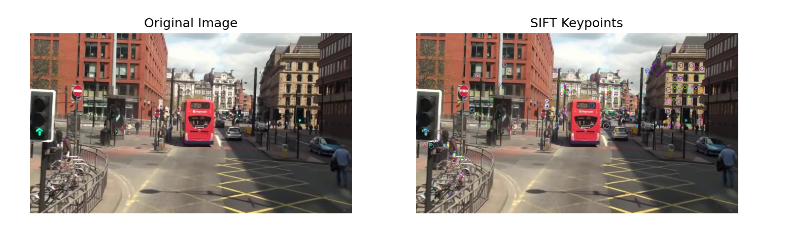
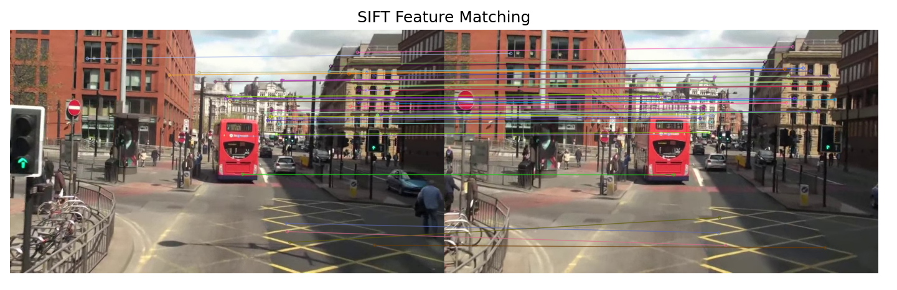
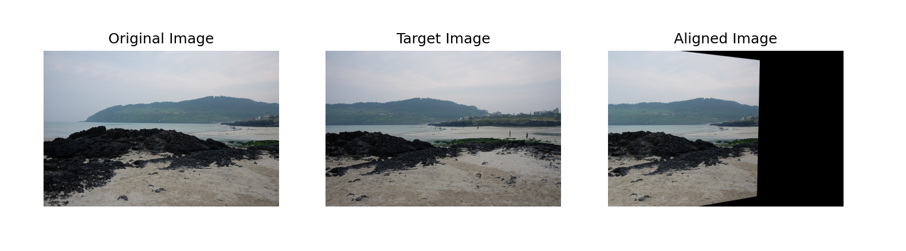

## 1️⃣ SIFT를 이용한 특징점 검출 및 시각화
### 🌀 과제 설명
- SIFT를 사용하여 이미지의 특징점을 찾고 시각화
<br>
  
### 📌 개념
- <b>SIFT(Scale-Invariant Feature Transform)</b> <br>
<p> : 크기(scale)와 회전(rotation)에 영향을 받지 않는 강력한 특징점 검출 알고리즘

- <b>특징점(Keypoint) & 기술자(Descriptor)</b> <br>
<p> : 이미지의 중요한 부분을 찾고, 해당 부분의 고유한 설명자를 생성

- <b>cv.drawKeypoints()</b>: 이미지 위에 검출된 특징점을 시각화
<br>

### 💻 주요 코드
<p>✔ <b>SIFT 객체 생성, 최대 500개 특징점 검출 </b><br><p><code>sift = cv.SIFT_create(nfeatures=500)</code><br></p>

<p>✔ <b>특징점과 기술자 계산</b><br> <p><code>keypoints, descriptors = sift.detectAndCompute(gray, None)</code><br>
<p>  - image: 입력 이미지 (Grayscale)<br>
<p>  - mask: 관심 영역을 지정할 마스크 (None이면 전체 이미지 사용)<br>

<p>✔ <b>특징점 시각화</b><br> 
<p><code>image_with_keypoints = cv.drawKeypoints(image, keypoints, None, flags=cv.DRAW_MATCHES_FLAGS_DRAW_RICH_KEYPOINTS)</code><br>
<p>  - image: 원본 이미지<br>
<p>  - keypoints:	SIFT 등의 알고리즘으로 검출된 특징점 리스트<br>
<p>  - outImage: 출력 이미지 (None이면 원본 이미지에 표시)<br>
<p>  - flags:	특징점 표시 방식 설정 (ex: 크기·방향 포함 여부)<br>
<br>

<br>


<details>
  <summary><b> 🧿 클릭해서 코드 보기 </b></summary>
  
  ```python
import cv2 as cv
import matplotlib.pyplot as plt

# 이미지 로드
image_path = 'C:/Users/82107/Desktop/cv/mot_color70.jpg'
image = cv.imread(image_path)
gray = cv.cvtColor(image, cv.COLOR_BGR2GRAY)

# SIFT 객체 생성 (특징점 개수 조절 가능)
sift = cv.SIFT_create(nfeatures=500)

# 특징점 검출 및 기술자 계산
keypoints, descriptors = sift.detectAndCompute(gray, None)

# 특징점 시각화
image_with_keypoints = cv.drawKeypoints(image, keypoints, None, flags=cv.DRAW_MATCHES_FLAGS_DRAW_RICH_KEYPOINTS)

# 이미지 출력
plt.figure(figsize=(12, 6))
plt.subplot(1, 2, 1)
plt.imshow(cv.cvtColor(image, cv.COLOR_BGR2RGB))
plt.title('Original Image')
plt.axis('off')

plt.subplot(1, 2, 2)
plt.imshow(cv.cvtColor(image_with_keypoints, cv.COLOR_BGR2RGB))
plt.title('SIFT Keypoints')
plt.axis('off')

plt.show()

 ```
</details>

<br>

### 🕵‍♀ 결과화면


<br>
<br>

## 2️⃣ SIFT를 이용한 두 영상 간 특징점 매칭
### 🌀 과제 설명
- 두 이미지 간 SIFT 특징점을 매칭하여 비교
<br>

### 📌 개념
- <b>BFMatcher (Brute-Force Matcher)</b><br>
<p> : 두 이미지의 특징점 기술자를 비교하여 가장 유사한 것들을 매칭
- <b>cv.BFMatcher(cv.NORM_L2, crossCheck=True)</b><br>
<p> : L2 거리 기준으로 매칭, crossCheck=True는 상호 일치하는 경우만 선택
- <b>cv.drawMatches()</b><br>
<p> : 두 이미지 사이에서 매칭된 특징점을 시각화
<br>

### 💻 주요 코드
<p>✔ <b>두 이미지 간 특징점을 매칭하는 BFMatcher 생성</b><br> <p><code>bf = cv.BFMatcher(cv.NORM_L2, crossCheck=True)</code><br>
<p>  - normType: 거리 계산 방법 (cv.NORM_L2: 유클리드 거리)<br>
<p>  - crossCheck: 상호 검증 여부 (True이면 양쪽에서 매칭된 경우만 선택)
<p>✔ <b>두 이미지의 특징점 기술자를 비교하여 가장 유사한 매칭을 반환</b><br> <p><code>matches = bf.match(descriptors1, descriptors2)</code><br>
<p>- descriptors1: 첫 번째 이미지의 특징점 기술자<br>
<p>✔ <b>각 특징점에 대해 가장 가까운 k개의 매칭을 반환 (KNN 방식)</b><br> <p><code>matches = bf.knnMatch(descriptors1, descriptors2, k=2)</code><br>
<p>  - k: 한 특징점당 비교할 최근접 특징점 개수
<br>

<details>
  <summary><b> 🧿 클릭해서 코드 보기 </b></summary>

  ```python
import cv2 as cv
import matplotlib.pyplot as plt

# 이미지 로드
image1_path = 'C:/Users/82107/Desktop/cv/mot_color70.jpg'
image2_path = 'C:/Users/82107/Desktop/cv/mot_color83.jpg'
image1 = cv.imread(image1_path)
image2 = cv.imread(image2_path)
gray1 = cv.cvtColor(image1, cv.COLOR_BGR2GRAY)
gray2 = cv.cvtColor(image2, cv.COLOR_BGR2GRAY)

# SIFT 객체 생성
sift = cv.SIFT_create()

# 특징점 검출 및 기술자 계산
keypoints1, descriptors1 = sift.detectAndCompute(gray1, None)
keypoints2, descriptors2 = sift.detectAndCompute(gray2, None)

# BFMatcher 생성 및 매칭 수행
bf = cv.BFMatcher(cv.NORM_L2, crossCheck=True)
matches = bf.match(descriptors1, descriptors2)

# 매칭 결과 정렬 (거리순)
matches = sorted(matches, key=lambda x: x.distance)

# 매칭 결과 시각화
image_matches = cv.drawMatches(image1, keypoints1, image2, keypoints2, matches[:50], None, flags=cv.DrawMatchesFlags_NOT_DRAW_SINGLE_POINTS)

# 결과 출력
plt.figure(figsize=(12, 6))
plt.imshow(cv.cvtColor(image_matches, cv.COLOR_BGR2RGB))
plt.title('SIFT Feature Matching')
plt.axis('off')
plt.show()

 ```
</details>

<br>

### 🕵‍♀ 결과화면


<br>
<br>

## 3️⃣ 호모그래피를 이용한 이미지 정합(Image Alignment)
### 🌀 과제 설명
- 특징점 매칭 후 호모그래피 변환을 이용하여 이미지 정렬
<br>

### 📌 개념
- <b>KNN 매칭</b>: 가장 가까운 두 개의 특징점을 찾아 비교하는 방식
- <b>Ratio Test</b>: 좋은 매칭을 선택하기 위해 사용하는 비율 검증 기법
- <b>Homography</b>: 이미지 간 투영 변환을 계산하는 행렬
- <b>RANSAC</b>: 이상치를 제거하는 알고리즘, 호모그래피 계산 시 자주 사용함
<br>

### 💻 주요 코드
<p> ✔ <b> 호모그래피 행렬 H 계산</b> <br>
<p><code>cv.findHomography(src_pts, dst_pts, method, ransacReprojThreshold)</code><br>
<p> - src_pts : 원본 이미지의 특징점 좌표 리스트
<p> - dst_pts : 대상 이미지의 특징점 좌표 리스트
<p> - method : 변환 계산 방법 (cv.RANSAC 또는 cv.LMEDS)
<p> - ransacReprojThreshold : RANSAC의 이상점 제거 임계값
<br>

<p> ✔ <b> 호모그래피 행렬 H를 이용해 이미지를 변환(정합).</b><br>
 <p><code>v.warpPerspective(image, H, dsize)</code><br>
<p> - image : 원본 이미지<br>
<p> - H : 변환할 호모그래피 행렬<br>
<p> - dsize : 출력 이미지 크기 (w, h) 튜플<br>

<p> ✔ <b> 두 이미지 간 매칭된 특징점을 시각적으로 연결하여 표시 </b> <br>
<p><code>cv.drawMatches(image1, keypoints1, image2, keypoints2, matches, outImg, flags)
</code>
<p> - keypoints: 이미지의 특징점 리스트
<p> - matches: 매칭된 특징점 리스트
<p> - outImg: 출력 이미지 (None이면 자동 생성)
<p> - flags: 매칭선 스타일 지정
<br>
<br>


<details>
  <summary><b> 🧿 클릭해서 코드 보기 </b></summary>

  ```python
import cv2 as cv
import numpy as np
import matplotlib.pyplot as plt

# 이미지 로드
image1_path = 'C:/Users/82107/Desktop/cv/img1.jpg'
image2_path = 'C:/Users/82107/Desktop/cv/img2.jpg'
image1 = cv.imread(image1_path)
image2 = cv.imread(image2_path)

# 이미지 로드 확인
if image1 is None or image2 is None:
    print("Error: One or both images could not be loaded. Check the file paths.")
    exit()

# 그레이스케일 변환
gray1 = cv.cvtColor(image1, cv.COLOR_BGR2GRAY)
gray2 = cv.cvtColor(image2, cv.COLOR_BGR2GRAY)

# SIFT 객체 생성
sift = cv.SIFT_create()

# 특징점 검출 및 기술자 계산
keypoints1, descriptors1 = sift.detectAndCompute(gray1, None)
keypoints2, descriptors2 = sift.detectAndCompute(gray2, None)

# BFMatcher 생성 및 매칭 수행
bf = cv.BFMatcher(cv.NORM_L2)
matches = bf.knnMatch(descriptors1, descriptors2, k=2)

# 좋은 매칭점 선택 (비율 테스트 적용)
good_matches = []
ratio_thresh = 0.75
for m, n in matches:
    if m.distance < ratio_thresh * n.distance:
        good_matches.append(m)

# 매칭 개수 확인
print(f"Number of good matches: {len(good_matches)}")

# 최소한의 매칭점 필요
if len(good_matches) > 10:
    src_pts = np.float32([keypoints1[m.queryIdx].pt for m in good_matches]).reshape(-1, 1, 2)
    dst_pts = np.float32([keypoints2[m.trainIdx].pt for m in good_matches]).reshape(-1, 1, 2)
    
    # 호모그래피 계산
    H, mask = cv.findHomography(src_pts, dst_pts, cv.RANSAC, 5.0)

    # 호모그래피 계산 실패 시 처리
    if H is None:
        print("Error: Homography calculation failed.")
        exit()
    
    # 이미지 정합
    h, w = image1.shape[:2]
    aligned_image = cv.warpPerspective(image1, H, (w, h))
    
    # 결과 출력
    plt.figure(figsize=(12, 6))
    plt.subplot(1, 3, 1)
    plt.imshow(cv.cvtColor(image1, cv.COLOR_BGR2RGB))
    plt.title('Original Image')
    plt.axis('off')
    
    plt.subplot(1, 3, 2)
    plt.imshow(cv.cvtColor(image2, cv.COLOR_BGR2RGB))
    plt.title('Target Image')
    plt.axis('off')
    
    plt.subplot(1, 3, 3)
    plt.imshow(cv.cvtColor(aligned_image, cv.COLOR_BGR2RGB))
    plt.title('Aligned Image')
    plt.axis('off')
    
    plt.show(block=True)  # 창이 바로 닫히지 않도록 설정
else:
    print("Not enough matches found to compute homography.")

 ```
</details>

<br>

### 🕵‍♀ 결과화면

