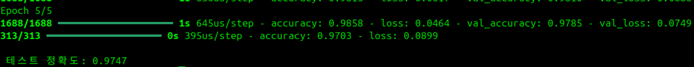
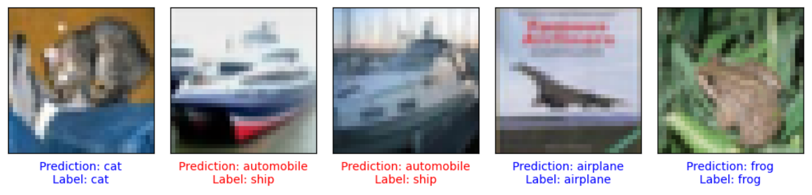
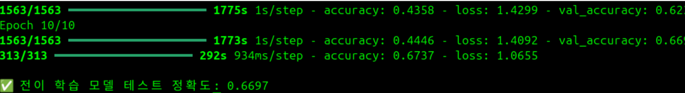

## 1️⃣MNIST 손글씨 분류를 위한 신경망 모델
### 🌀 과제 설명
- MNIST 손글씨 이미지(0~9 숫자)를 분류하는 간단한 신경망(MLP) 모델 구현
- 데이터 전처리, 모델 구성, 학습 및 평가를 포함
<br>

  
### 📌 개념
- <b>Flatten</b> <br>
<p> : 2D 이미지를 1D 벡터로 변환하여 Dense 층에 전달

- <b>One-Hot Encoding</b> <br>
<p> : 정수 레이블을 이진 벡터로 변환하여 분류에 적합한 형태로 변경

- <b>Softmax</b>: 클래스별 확률을 출력하여 가장 높은 값을 가진 클래스를 예측
<br>

### 💻 주요 코드
<p>✔ <b> 1. 데이터 로드 및 정규화 </b><br><p><code>(x_train, y_train), (x_test, y_test) = mnist.load_data()
x_train = x_train / 255.0
x_test = x_test / 255.0
</code></p>
<p>  -load_data(): MNIST 훈련/테스트 세트 불러오기<br>
<br>
  
<p>✔ <b> 2. 라벨 인코딩 (One-Hot)</b><br> <p><code>from tensorflow.keras.utils import to_categorical
y_train = to_categorical(y_train, 10)
y_test = to_categorical(y_test, 10)
</code>
<p>  - 정수형 클래스 레이블을 10차원 이진 벡터로 변환
<br>
<br>
<p>✔ <b> 3. 신경망 모델 구성</b><br> 
<p><code>model = Sequential([
    Flatten(input_shape=(28, 28)),
    Dense(128, activation='relu'),
    Dense(10, activation='softmax')
])
</code>
<p> - Flatten: 28x28 이미지를 784차원 벡터로 바꿈<br>
<p> - Dense(128): 은닉층 (ReLU 활성화)<br>
<p> - Dense(10, softmax): 다중 클래스 분류용 출력층<br>
<br>
<p>✔ <b> 4. 모델 컴파일</b><br> 
<p><code>model = Sequential([
    Flatten(input_shape=(28, 28)),
    Dense(128, activation='relu'),
    Dense(10, activation='softmax')
])
</code>
<p> - Flatten: 28x28 이미지를 784차원 벡터로 바꿈<br>
<p> - Dense(128): 은닉층 (ReLU 활성화)<br>
<p> - Dense(10, softmax): 다중 클래스 분류용 출력층<br>

<br>
<br>


<details>
  <summary><b> 🧿 클릭해서 코드 보기 </b></summary>
  
  ```python
import tensorflow as tf
from tensorflow.keras.datasets import mnist
from tensorflow.keras.models import Sequential
from tensorflow.keras.layers import Dense, Flatten
from tensorflow.keras.utils import to_categorical

# 1. MNIST 데이터셋 로드
(x_train, y_train), (x_test, y_test) = mnist.load_data()

# 2. 데이터 전처리
# 픽셀 값 정규화 (0~255 → 0~1)
x_train = x_train / 255.0
x_test = x_test / 255.0

# 라벨을 one-hot encoding
y_train = to_categorical(y_train, 10)
y_test = to_categorical(y_test, 10)

# 3. 간단한 신경망 모델 구성
model = Sequential([
    Flatten(input_shape=(28, 28)),  # 28x28 이미지를 1차원 벡터로 변환
    Dense(128, activation='relu'), # 은닉층 (128개의 뉴런, ReLU 활성화 함수)
    Dense(10, activation='softmax') # 출력층 (10개의 숫자 분류)
])

# 4. 모델 컴파일
model.compile(optimizer='adam',
              loss='categorical_crossentropy',
              metrics=['accuracy'])

# 5. 모델 훈련
model.fit(x_train, y_train, epochs=5, batch_size=32, validation_split=0.1)

# 6. 모델 평가
test_loss, test_accuracy = model.evaluate(x_test, y_test)
print(f"\n✅ 테스트 정확도: {test_accuracy:.4f}")


 ```
</details>

<br>

### 🕵‍♀ 결과화면


<br>
<br>

## 2️⃣ Mediapipe를 활용한 실시간 얼굴 랜드마크 추적 프로그램
### 🌀 과제 설명
- 웹캠을 통해 얼굴을 실시간으로 인식하고, Mediapipe의 FaceMesh 모델을 이용하여 얼굴의 주요 랜드마크(눈, 입술, 홍채 등)를 시각화하는 프로그램 구현
- OpenCV로 카메라 연결 및 영상 출력, Mediapipe로 얼굴 특징점 추출
<br>

### 📌 개념
- <b>Mediapipe FaceMesh</b><br>
<p> : 얼굴의 468개 랜드마크를 고해상도로 추출해주는 모델로, 눈, 입술, 홍채 등의 세밀한 위치를 탐지 가능<br>
- <b>cv2.flip()</b><br>
<p> :영상을 좌우 반전하여 거울 효과를 적용 (자연스러운 사용자 경험 제공)
- <b>BGR → RGB 변환</b><br>
<p> :OpenCV는 BGR 형식을 사용하지만 Mediapipe는 RGB를 사용하므로 cv2.cvtColor로 변환 필요
- <b>랜드마크 좌표 변환</b><br>
<p> :Mediapipe의 랜드마크는 정규화된 좌표([0,1] 범위)이므로 이미지 크기에 맞게 정수형 픽셀 좌표로 변환해야 함
<br>
  <br>
<br>

### 💻 주요 코드
<p>✔ <b>1. Mediapipe FaceMesh 모델 초기화</b><br> <p><code>face_mesh = mp_face_mesh.FaceMesh(
    max_num_faces=1,
    refine_landmarks=True,
    min_detection_confidence=0.5,
    min_tracking_confidence=0.5
)
</code>
<p>  - 최대 1명의 얼굴만 인식<br>
<p>  - refine_landmarks=True로 눈, 입술, 홍채 등의 더 정밀한 위치 포함
  <br>
  <br>
<p>✔ <b>2. 웹캠 연결 및 프레임 처리(정규화)
</b><br> <p><code>cap = cv2.VideoCapture(0)</code>
<p>- 기본 카메라(0번 장치) 사용<br>
  <br>
</b><br> <p><code>frame = cv2.flip(frame, 1)
rgb_frame = cv2.cvtColor(frame, cv2.COLOR_BGR2RGB)
</code>
<p>- 영상 좌우 반전 및 RGB 변환 (Mediapipe에 맞게)
<br>
  <br>
<p>✔ <b> 3. 얼굴 랜드마크 추출 및 시각화</b><br> <p><code>results = face_mesh.process(rgb_frame)
</code><br>
<p> - 현재 프레임에서 얼굴 랜드마크 추출<br>
<p><code>for lm in face_landmarks.landmark:
    x, y = int(lm.x * w), int(lm.y * h)
    cv2.circle(frame, (x, y), 1, (0, 255, 0), -1)
</code><br>
<p> - 정규화된 좌표를 픽셀 좌표로 변환 후 초록 점으로 시각화
<br>
<br>
<p>✔ <b>4. 결과 출력 및 종료 조건</b><br> <p><code>cv2.imshow('FaceMesh Landmark Tracker', frame)
if cv2.waitKey(1) & 0xFF == 27:
    break
</code>
<p>  - 영상 출력 및 ESC(27번 키) 입력 시 종료<br>
  <br>
  <br>
<br>
<details>
  <summary><b> 🧿 클릭해서 코드 보기 </b></summary>

  ```python
import tensorflow as tf
from tensorflow.keras import layers, models
import matplotlib.pyplot as plt
import numpy as np

# 1. CIFAR-10 데이터셋 로드
from tensorflow.keras.datasets import cifar10

(x_train, y_train), (x_test, y_test) = cifar10.load_data()

# 클래스 이름 정의
class_names = ['airplane', 'automobile', 'bird', 'cat', 'deer',
               'dog', 'frog', 'horse', 'ship', 'truck']

print("Train shape:", x_train.shape)
print("Test shape:", x_test.shape)

# 2. 데이터 전처리: 픽셀 정규화 (0~255 → 0~1)
x_train = x_train.astype('float32') / 255.0
x_test = x_test.astype('float32') / 255.0

# 3. CNN 모델 구성
model = models.Sequential([
    layers.Conv2D(32, (3, 3), activation='relu', input_shape=(32, 32, 3)),
    layers.MaxPooling2D((2, 2)),

    layers.Conv2D(64, (3, 3), activation='relu'),
    layers.MaxPooling2D((2, 2)),

    layers.Conv2D(64, (3, 3), activation='relu'),

    layers.Flatten(),
    layers.Dense(64, activation='relu'),
    layers.Dense(10, activation='softmax')  # CIFAR-10은 10개 클래스
])

# 4. 모델 컴파일
model.compile(optimizer='adam',
              loss='sparse_categorical_crossentropy',
              metrics=['accuracy'])

# 5. 모델 훈련
history = model.fit(x_train, y_train, epochs=10,
                    validation_data=(x_test, y_test))

# 6. 성능 평가
test_loss, test_acc = model.evaluate(x_test, y_test, verbose=2)
print(f"\n✅ 테스트 정확도: {test_acc:.4f}")

# 7. 예측 수행 (테스트 이미지 일부 시각화)
predictions = model.predict(x_test)

# 8. 결과 시각화 함수
def plot_image(i, predictions_array, true_label, img):
    true_label, img = true_label[i][0], img[i]
    plt.grid(False)
    plt.xticks([])
    plt.yticks([])

    plt.imshow(img)

    predicted_label = np.argmax(predictions_array)
    color = 'blue' if predicted_label == true_label else 'red'

    plt.xlabel(f"Prediction: {class_names[predicted_label]}\nLabel: {class_names[true_label]}", color=color)

# 9. 예측 결과 출력 (5개 이미지)
plt.figure(figsize=(10, 5))
for i in range(5):
    plt.subplot(1, 5, i + 1)
    plot_image(i, predictions[i], y_test, x_test)
plt.tight_layout()
plt.show()


 ```
</details>

<br>

### 🕵‍♀ 결과화면


<br>
<br>

## 3️⃣ VGG16을 활용한 전이 학습 기반 이미지 분류기
### 🌀 과제 설명
- 사전 학습된 VGG16 모델을 활용하여 CIFAR-10 데이터셋 분류기 성능을 향상시킴
- VGG16의 Feature Extractor로서의 성능을 이용하고, 그 위에 새로운 분류기를 쌓아 학습
<br>

### 📌 개념
- <b>전이 학습 (Transfer Learning)</b>
<p> * 대규모 데이터셋에서 학습된 모델의 가중치를 가져와 새로운 과제에 재활용하는 기법. </p>
<p> * 적은 데이터로도 높은 성능을 낼 수 있음.</p>

- <b>VGG16</b>
<p> * ImageNet 데이터셋에 대해 학습된 깊은 CNN 모델.</p>
<p> * `tensorflow.keras.applications`에서 제공됨.</p> 
<p>: `include_top=False`로 설정하면, 최종 Fully Connected Layer를 제거한 특징 추출기로 활용 가능</p>

- <b>CIFAR-10</b>

<p>: 총 10개의 이미지 클래스를 가진 소형 컬러 이미지 데이터셋 (32×32 크기)</p> <p>: VGG16의 입력 요구(224×224)로 크기 조정 필요</p> <br>

### 💻 주요 코드
<p> ✔ <b> CIFAR-10 데이터 로드 및 정규화</b> <br>
<p><code>(x_train, y_train), (x_test, y_test) = cifar10.load_data()
x_train = tf.image.resize(x_train, [224, 224]) / 255.0
x_test = tf.image.resize(x_test, [224, 224]) / 255.0</code><br>
<p> - resize(): CIFAR-10 이미지를 VGG16이 요구하는 크기(224x224)로 변경
<p> - 정규화: 모델 학습 속도 향상을 위해 0~1 범위로 조정
<br>
<br>
<p> ✔ <b> VGG16 모델 불러오기 및 고정</b><br>
 <p><code>base_model = VGG16(weights='imagenet', include_top=False, input_shape=(224, 224, 3))
base_model.trainable = False</code><br>
<p> - include_top=False: FC Layer 제거 → Feature Extractor로 사용
<p> - trainable=False: 기존 가중치를 동결 → 학습 시 업데이트되지 않음
<br>
<br>
<p> ✔ <b> 새로운 분류기 쌓기 </b> <br>
<p><code>model = models.Sequential([
    base_model,
    layers.Flatten(),
    layers.Dense(256, activation='relu'),
    layers.Dropout(0.5),
    layers.Dense(10, activation='softmax')
])
</code>
<p> - Flatten(): Feature map을 1D 벡터로 변환
<p> - Dense(256): 새로운 Fully Connected Layer
<p> - Dropout: 과적합 방지를 위해 50% 노드 비활성화
<p> - Dense(10): CIFAR-10 클래스 수에 맞춘 출력층 (Softmax)
<br>
<br>
<p> ✔️ <b> 모델 컴파일 및 학습</b><br>
<p><code>model.compile(optimizer='adam',
              loss='sparse_categorical_crossentropy',
              metrics=['accuracy'])

history = model.fit(x_train, y_train, epochs=10, validation_data=(x_test, y_test))
</code><br>
<p> - optimizer='adam': 빠른 수렴을 위한 옵티마이저
<p> - sparse_categorical_crossentropy: 정수 형태의 레이블용 손실함수
<p> - validation_data: 검증 정확도를 함께 확인하며 훈련 가능
<br>
<br>
<p> ✔️ <b> 성능 평가</b><br>
<p><code>test_loss, test_acc = model.evaluate(x_test, y_test)
print(f"\n✅ 전이 학습 모델 테스트 정확도: {test_acc:.4f}")
</code>
<p> - 테스트 데이터로 최종 모델 평가
<p> - evaluate(): 손실값과 정확도 출력
<br>
<br>

<br>
<details>
  <summary><b> 🧿 클릭해서 코드 보기 </b></summary>

  ```python
import tensorflow as tf
from tensorflow.keras import layers, models
from tensorflow.keras.applications import VGG16
from tensorflow.keras.datasets import cifar10
import numpy as np
import matplotlib.pyplot as plt

# 1. 데이터 로드 및 전처리
(x_train, y_train), (x_test, y_test) = cifar10.load_data()

# CIFAR-10은 (32,32,3)이므로 VGG16 (224,224,3)로 resize
x_train = tf.image.resize(x_train, [224, 224]) / 255.0
x_test = tf.image.resize(x_test, [224, 224]) / 255.0

# 2. VGG16 불러오기 (최상위 레이어 제외)
base_model = VGG16(weights='imagenet', include_top=False, input_shape=(224, 224, 3))

# 사전학습된 가중치 고정 (Feature Extractor로 사용)
base_model.trainable = False

# 3. 새 분류기 구성 (Fine-tuning용)
model = models.Sequential([
    base_model,
    layers.Flatten(),
    layers.Dense(256, activation='relu'),
    layers.Dropout(0.5),
    layers.Dense(10, activation='softmax')  # CIFAR-10 클래스 수
])

# 4. 모델 컴파일
model.compile(optimizer='adam',
              loss='sparse_categorical_crossentropy',
              metrics=['accuracy'])

# 5. 모델 학습
history = model.fit(x_train, y_train, epochs=10,
                    validation_data=(x_test, y_test))

# 6. 성능 평가
test_loss, test_acc = model.evaluate(x_test, y_test)
print(f"\n✅ 전이 학습 모델 테스트 정확도: {test_acc:.4f}")
 ```
</details>

<br>

### 🕵‍♀ 결과화면


