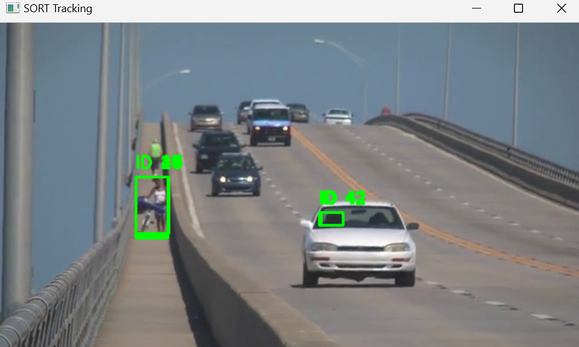
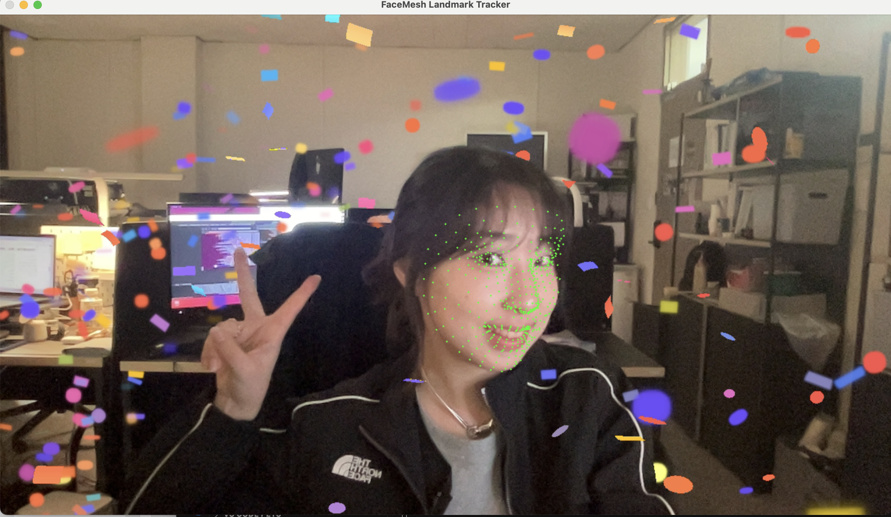

## 1️⃣ YOLOv4 + SORT를 이용한 객체 탐지 및 추적 시스템
### 🌀 과제 설명
- YOLOv4를 활용하여 영상 속 객체(사람, 차량 등)를 실시간 탐지
- SORT(Simple Online and Realtime Tracking) 알고리즘을 통해 객체 추적
<br>

  
### 📌 개념
- <b>YOLOv4 (You Only Look Once v4)</b> <br>
<p> : 객체를 빠르게 탐지하는 딥러닝 기반 모델로, 단일 프레임에서 다양한 객체의 위치와 종류를 예측 가능- 
 - <b>NMS (Non-Maximum Suppression)</b> <br>
<p> : 중복된 박스를 제거하고 신뢰도가 높은 하나만 남기기 위한 필터링 기법
- <b>SORT (Simple Online and Realtime Tracking)</b>:: 객체 탐지 결과를 기반으로 간단한 칼만 필터와 IOU 기반의 할당을 통해 객체를 실시간으로 추적하는 알고리즘


<br>

### 💻 주요 코드
<p>✔ <b> 1. YOLOv4 모델 및 클래스 이름 불러오기 </b><br><p><code>net = cv2.dnn.readNet("yolo/yolov4.weights", "yolo/yolov4.cfg")
with open("yolo/coco.names", "r") as f:
    classes = [line.strip() for line in f.readlines()]
</code></p>
<p>  -yolov4.weights, yolov4.cfg, coco.names는 사전에 YOLO 공식 페이지에서 다운로드 필요
<br>
  
<p>✔ <b>  2. 객체 탐지를 위한 전처리 및 예측 (One-Hot)</b><br> <p><code>blob = cv2.dnn.blobFromImage(frame, 1/255.0, (416, 416), swapRB=True, crop=False)
net.setInput(blob)
outs = net.forward(output_layers)
</code>
<p>  - 입력 이미지를 YOLO가 요구하는 형식으로 변환 후 예측 수행
<br>
<br>
<p>✔ <b> 3. 출력 결과 해석 및 NMS 적용</b><br> 
<p><code>for detection in out:
    scores = detection[5:]
    class_id = np.argmax(scores)
    confidence = scores[class_id]
    ...
indices = cv2.dnn.NMSBoxes(boxes, confidences, 0.5, 0.4)
</code>
<p> - confidence 0.5 이상인 박스만 탐지 대상으로 사용<br>
<p> - NMS로 중복 제거 후 최종 탐지 결과 추림<br>
<br>
<p>✔ <b>4. SORT 알고리즘을 통한 객체 추적</b><br> 
<p><code>tracker = Sort()
tracked_objects = tracker.update(np.array(dets))
</code>
<p> - 탐지된 박스를 [x1, y1, x2, y2, score] 형식으로 정리 후 SORT에 입력<br>
<p> - 각 객체마다 고유한 ID 부여됨<br>

<br>
<br>


<details>
  <summary><b> 🧿 클릭해서 코드 보기 </b></summary>
  
  ```python
import cv2
import numpy as np
from sort.sort import Sort

# Load YOLOv4
net = cv2.dnn.readNet("yolo/yolov4.weights", "yolo/yolov4.cfg")
layer_names = net.getLayerNames()
output_layers = [layer_names[i - 1] for i in net.getUnconnectedOutLayers().flatten()]

# Load class names
with open("yolo/coco.names", "r") as f:
    classes = [line.strip() for line in f.readlines()]

# Initialize video and tracker
cap = cv2.VideoCapture(1)  # 웹캠 or 비디오 경로
tracker = Sort()

while True:
    ret, frame = cap.read()
    if not ret:
        break

    height, width = frame.shape[:2]

    # 객체 검출을 위한 전처리
    blob = cv2.dnn.blobFromImage(frame, 1/255.0, (416, 416), swapRB=True, crop=False)
    net.setInput(blob)
    outs = net.forward(output_layers)

    # YOLOv4의 출력 해석
    boxes = []
    confidences = []
    class_ids = []

    for out in outs:
        for detection in out:
            scores = detection[5:]
            class_id = np.argmax(scores)
            confidence = scores[class_id]
            if confidence > 0.5:
                center_x, center_y, w, h = (detection[0:4] * np.array([width, height, width, height])).astype('int')
                x = int(center_x - w / 2)
                y = int(center_y - h / 2)
                boxes.append([x, y, int(w), int(h)])
                confidences.append(float(confidence))
                class_ids.append(class_id)

    # NMS 적용
    indices = cv2.dnn.NMSBoxes(boxes, confidences, 0.5, 0.4)

    dets = []
    for i in indices.flatten():
        x, y, w, h = boxes[i]
        dets.append([x, y, x + w, y + h, confidences[i]])  # 좌표 + 신뢰도

    # SORT로 추적
    tracked_objects = tracker.update(np.array(dets))

    # 결과 시각화
    for obj in tracked_objects:
        x1, y1, x2, y2, obj_id = obj.astype(int)
        cv2.rectangle(frame, (x1, y1), (x2, y2), (0,255,0), 2)
        cv2.putText(frame, f'ID: {int(obj_id)}', (x1, y1-10), cv2.FONT_HERSHEY_SIMPLEX, 0.6, (0,255,0), 2)

    cv2.imshow("SORT Tracker", frame)
    if cv2.waitKey(1) == 27:
        break

cap.release()
cv2.destroyAllWindows()


 ```
</details>

<br>

### 🕵‍♀ 결과화면


<br>
<br>

## 2️⃣ Mediapipe를 활용한 실시간 얼굴 랜드마크 추적 프로그램
### 🌀 과제 설명
- 웹캠을 통해 얼굴을 실시간으로 인식하고, Mediapipe의 FaceMesh 모델을 이용하여 얼굴의 주요 랜드마크(눈, 입술, 홍채 등)를 시각화하는 프로그램 구현
- OpenCV로 카메라 연결 및 영상 출력, Mediapipe로 얼굴 특징점 추출
<br>

### 📌 개념
- <b>Mediapipe FaceMesh</b><br>
<p> : 얼굴의 468개 랜드마크를 고해상도로 추출해주는 모델로, 눈, 입술, 홍채 등의 세밀한 위치를 탐지 가능<br>
- <b>cv2.flip()</b><br>
<p> :영상을 좌우 반전하여 거울 효과를 적용 (자연스러운 사용자 경험 제공)
- <b>BGR → RGB 변환</b><br>
<p> :OpenCV는 BGR 형식을 사용하지만 Mediapipe는 RGB를 사용하므로 cv2.cvtColor로 변환 필요
- <b>랜드마크 좌표 변환</b><br>
<p> :Mediapipe의 랜드마크는 정규화된 좌표([0,1] 범위)이므로 이미지 크기에 맞게 정수형 픽셀 좌표로 변환해야 함
<br>
  <br>
<br>

### 💻 주요 코드
<p>✔ <b>1. Mediapipe FaceMesh 모델 초기화</b><br> <p><code>face_mesh = mp_face_mesh.FaceMesh(
    max_num_faces=1,
    refine_landmarks=True,
    min_detection_confidence=0.5,
    min_tracking_confidence=0.5
)
</code>
<p>  - 최대 1명의 얼굴만 인식<br>
<p>  - refine_landmarks=True로 눈, 입술, 홍채 등의 더 정밀한 위치 포함
  <br>
  <br>
<p>✔ <b>2. 웹캠 연결 및 프레임 처리(정규화)
</b><br> <p><code>cap = cv2.VideoCapture(0)</code>
<p>- 기본 카메라(0번 장치) 사용<br>
  <br>
</b><br> <p><code>frame = cv2.flip(frame, 1)
rgb_frame = cv2.cvtColor(frame, cv2.COLOR_BGR2RGB)
</code>
<p>- 영상 좌우 반전 및 RGB 변환 (Mediapipe에 맞게)
<br>
  <br>
<p>✔ <b> 3. 얼굴 랜드마크 추출 및 시각화</b><br> <p><code>results = face_mesh.process(rgb_frame)
</code><br>
<p> - 현재 프레임에서 얼굴 랜드마크 추출<br>
<p><code>for lm in face_landmarks.landmark:
    x, y = int(lm.x * w), int(lm.y * h)
    cv2.circle(frame, (x, y), 1, (0, 255, 0), -1)
</code><br>
<p> - 정규화된 좌표를 픽셀 좌표로 변환 후 초록 점으로 시각화
<br>
<br>
<p>✔ <b>4. 결과 출력 및 종료 조건</b><br> <p><code>cv2.imshow('FaceMesh Landmark Tracker', frame)
if cv2.waitKey(1) & 0xFF == 27:
    break
</code>
<p>  - 영상 출력 및 ESC(27번 키) 입력 시 종료<br>
  <br>
  <br>
<br>
<details>
  <summary><b> 🧿 클릭해서 코드 보기 </b></summary>

  ```python
import cv2
import mediapipe as mp

# Mediapipe 초기화
mp_face_mesh = mp.solutions.face_mesh
mp_drawing = mp.solutions.drawing_utils

# 얼굴 랜드마크 스타일
drawing_spec = mp_drawing.DrawingSpec(thickness=1, circle_radius=1, color=(0, 255, 0))

# FaceMesh 모델 초기화
face_mesh = mp_face_mesh.FaceMesh(
    max_num_faces=1,
    refine_landmarks=True,  # 눈, 입술, 홍채 등 정밀한 위치 포함
    min_detection_confidence=0.5,
    min_tracking_confidence=0.5
)

# OpenCV 웹캠 연결
cap = cv2.VideoCapture(0)

while cap.isOpened():
    success, frame = cap.read()
    if not success:
        print("카메라를 열 수 없습니다.")
        break

    # 영상 좌우반전 (거울 효과), BGR → RGB 변환
    frame = cv2.flip(frame, 1)
    rgb_frame = cv2.cvtColor(frame, cv2.COLOR_BGR2RGB)

    # 랜드마크 검출
    results = face_mesh.process(rgb_frame)

    h, w, _ = frame.shape

    # 랜드마크 시각화
    if results.multi_face_landmarks:
        for face_landmarks in results.multi_face_landmarks:
            for lm in face_landmarks.landmark:
                x, y = int(lm.x * w), int(lm.y * h)
                cv2.circle(frame, (x, y), 1, (0, 255, 0), -1)  # 작은 초록 점

    # 결과 영상 출력
    cv2.imshow('FaceMesh Landmark Tracker', frame)

    # ESC 키 누르면 종료
    if cv2.waitKey(1) & 0xFF == 27:
        break

# 정리
cap.release()
cv2.destroyAllWindows()

 ```
</details>

<br>

### 🕵‍♀ 결과화면


<br>
<br>

